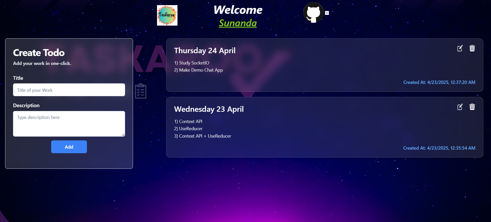

# React + Vite

This template provides a minimal setup to get React working in Vite with HMR and some ESLint rules.

Currently, two official plugins are available:

- [@vitejs/plugin-react](https://github.com/vitejs/vite-plugin-react/blob/main/packages/plugin-react/README.md) uses [Babel](https://babeljs.io/) for Fast Refresh
- [@vitejs/plugin-react-swc](https://github.com/vitejs/vite-plugin-react-swc) uses [SWC](https://swc.rs/) for Fast Refresh

# Backend Repository
🔗 **Link**: [[https://github.com/Sunanda01/Taskaroo_Server.git](https://github.com/Sunanda01/Taskaroo_Server.git)]

## Screen
- Register Page
- Verification Page
- Login Page
- Home
- Update Profile
- Update Password
- Forget Password

<br/>

## Quick Glimpses 
<table>
  <tr>
    <td>Register Page<br></td>
     <td>Login Page<br></td>
    </tr>
   <tr>
    <td colspan="2">Home<br/> </td>
  </tr>
</table>   
<br/>

## Get Started
Here I have actually kept the frontend of Taskaroo web application.

## Clone the repo
First, clone the repo:
```bash
https://github.com/Sunanda01/Taskaroo_Client.git
```

## Add .env files that is the secret of this project
```bash
Find .env file by searching import.meta.env as its a vite project
```
